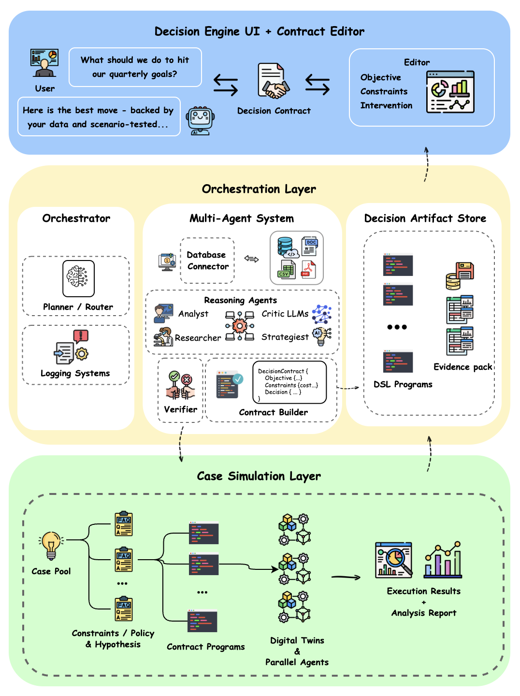

# Workflow Overview: Reezen (An AI Platform that Stress-tests Strategies Before Execution)

Reezen is an agentic decision-engineering system that transforms ambiguous, high-stakes strategic questions into structured, testable decision specs and auditable, evidence-backed recommendations.

## Architecture & Core Primitives

Reezen is built around two core primitives designed to eliminate black-box behavior and enable structured validation:

- **`DecisionContract` (Input Spec):** A typed specification that captures objectives, constraints, assumptions, risk thresholds, evidence requirements, and permissible interventions. It serves as the source of truth for the entire agentic workflow
- **`DecisionArtifact` (Output Pack):** A persistent, searchable record of the full decision logic: assumptions, scenarios, simulation results, counterfactual tests, sensitivity analyses, trade-offs, and the final recommendation. Over time, these artifacts become a compounding knowledge base of how and why each decision was made.

## The Execution Loop

1. **Intent Synthesis:** Translate an ambiguous user question into a draft `DecisionContract` with structured assumptions and tunable parameters.
2. **Constraint Editor:** The user reviews, adjusts, and locks constraints, assumptions, and evidence requirements before execution.
3. **Multi-Agent Orchestration:** Specialized agents generate competing strategies, identify key uncertainties, and produce a test plan. Parallel agents explore alternative assumptions and framings to reduce blind spots.
4. **Simulation & Stress-Testing:** Candidate strategies are evaluated via simulation templates and counterfactual sweeps (sensitivities, boundary conditions, and failure modes) to validate which options hold up under explicit assumptions.
5. **Artifact Generation:** Produce a `DecisionArtifact` designed for auditability, search, and future replay, closing the loop from ambiguity to validated recommendation.

## License

Apache 2.0 - See [LICENSE](LICENSE) file for details.

## Support

For issues and questions:
- GitHub Issues: https://github.com/coindef/workflow/
- Documentation: See `/docs` directory
